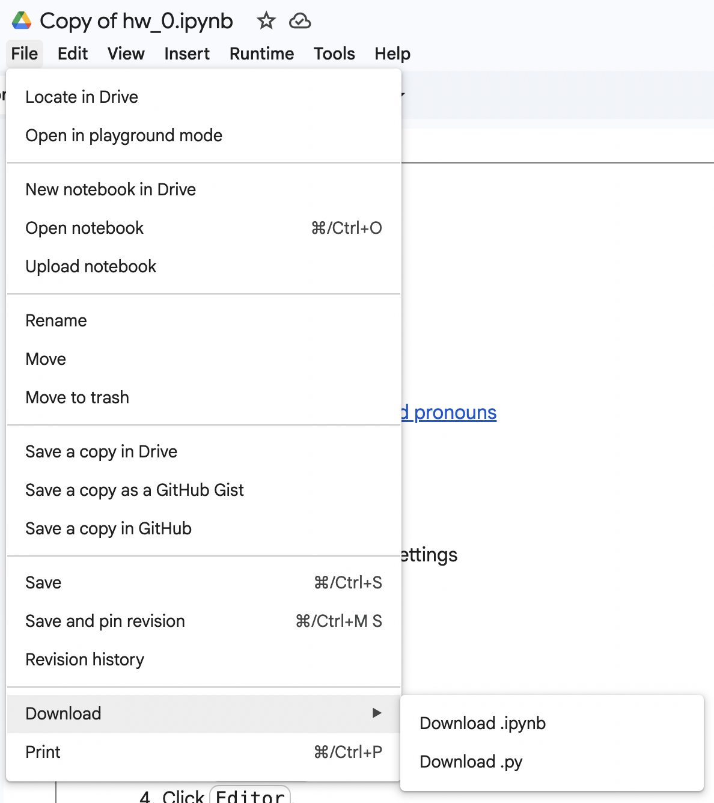

# General assignment information

- [Due dates](syllabus.md#schedule)
- [Scoring](syllabus.md#assignment-scoring)
- [Open-ended assignment info](assignments/open_ended.md)

## Getting started

To edit/execute a Homework/lecture notebook:

1. Open the page for the Homework/Lecture on this site.
   - For example: [Homework 0](hw_0.ipynb)
1. Click the launch button (🚀) at the top.
1. You should now see the notebook in Google Colab.
1. Make sure you're using your school Google account. [How to switch.](https://support.google.com/accounts/answer/1721977)
1. Click `Copy to Drive`.

That is now your own copy; make edits in there directly.

### [Open-ended assignments](assignments/open_ended.md)

You'll create your own notebook.

## Tips

- **Read the instructions carefully.** Like word problems from math class, they are very specific in what they are asking for.
- **Ask for help.**
  - The assignments are meant to be challenging, not impossible.
  - Try and work through problems on your own to start. If you are stuck for more than a half hour, [step away](https://dankim.org/posts/cant-crack-that-programming-problem/). If you _still_ can't figure it out, ask for help.
    - [Ed](https://brightspace.nyu.edu/d2l/le/lessons/477758/topics/11846240)
    - [Office hours](https://python-public-policy.afeld.me/en/nyu/syllabus.html#instructor-information)

### Coding in general

- Make variable names descriptive.
  - Do as I say, not as I do!
- Only do one thing per line.
  - Makes troubleshooting easier
- **Spot check your results.** If you are transforming data from a previous Step, compare the results, do a handful of the calculations manually, etc. to ensure that the results are correct.
- **[Don't repeat yourself (DRY).](https://dzone.com/articles/is-your-code-dry-or-wet)** If you find yourself copying and pasting code within your file(s), there's probably a better way to do it.
- **Avoid [hard-coding](https://www.quora.com/What-does-hard-coded-something-mean-in-computer-programming-context) values.** Don't rely on things like row numbers or column order being stable, in case the dataset were to be updated.

### Jupyter / Google Colab

- Keep each cell to only a few lines of code.
  - Allows/encourages you to output intermediate results, ensuring that everything is working as expected.
- You are always welcome to **add cells**. You probably don't want more than a few lines of code in each. This makes the spot checking of intermediate results easier.
- Make notebooks [idempotent](https://en.wikipedia.org/wiki/Idempotence).
  - Makes your work reproducible.
  - Use `Restart session and run all` (⏩ button in toolbar).

## Submission

1. Ensure all the outputs are visible and the notebook is cleaned up.
   - This is a good time to run the notebook end-to-end with `Restart session and run all`.
   - See [general scoring criteria](syllabus.md#assignment-scoring).
1. Ensure the notebook doesn't contain any sensitive information. (Only really applicable to [open-ended assignments](assignments/open_ended.md).) This might include:
   - API keys
   - Personally-identifiable information (PII; data about individuals)
1. `Download .ipynb` and `.py` (two files).

   

1. Upload both files to [the Gradescope Assignment](https://brightspace.nyu.edu/d2l/le/lessons/477758/topics/11846241).

### Notes

- You can ignore Gradescope saying "Large file hidden". The file can be downloaded when grading.
- In-class exercises will not be submitted/graded.

## Common issues

- **Mounting Google Drive is slow or fails:** See [the Google Colab help page](https://research.google.com/colaboratory/faq.html#drive-timeout).
- **Can't load a file from Drive with `requests.get()`:** Use [`open()`](https://docs.python.org/3/tutorial/inputoutput.html#reading-and-writing-files).
  - [How to read a JSON file](https://www.freecodecamp.org/news/python-parse-json-how-to-read-a-json-file/#how-to-parse-and-read-a-json-file-in-python)
- **When using [`choropleth()`](https://plotly.com/python/choropleth-maps/)/[`choropleth_map()`](https://plotly.com/python/tile-county-choropleth/), nothing appears on the map:** Make sure:
  - Your `locations` corresponds to the DataFrame column name and `featureidkey` is set to `properties.<property name>` matching the GeoJSON
    - See [how we found the property name to use](lecture_3.ipynb#geospatial-data)
  - The column and the GeoJSON properties have values that match
- **`SettingWithCopyWarning`:** [How to fix](https://www.dataquest.io/blog/settingwithcopywarning/)
- **`input()` stuck:** Jupyter can be a bit buggy when dealing with interactive input. If it seems to get stuck or you aren't seeing a prompt when you'd expect one, try clicking the `Runtime` menu then `Restart Kernel`.
- **In a visualization, the values are out of order along the axis, or you're seeing vertical/zig-zag-y lines:** Make sure that:
  - The values are integers/floats/[timestamps](https://plotly.com/python/line-charts/#line-plots-on-date-axes), not strings, where applicable.
  - [Line charts: The column used for the X axis is sorted.](https://plotly.com/python/line-charts/#data-order-in-line-charts)
- [**`AttributeError: partially initialized module 'orjson' has no attribute 'OPT_NON_STR_KEYS'`:**](https://github.com/plotly/plotly.py/issues/3567) Add the following cell before your other Plotly code, then `Restart session and run all`.

  ```python
  import plotly.io

  plotly.io.json.config.default_engine = 'json'
  ```

### Runtime and memory issues

The runtime is [the place where Python is installed and the code is actually executing](https://docs.jupyter.org/en/stable/projects/kernels.html#kernels), in the cloud somewhere. If your runtime is repeatedly crashing, you're probably running out of memory.

- [Get more memory through Colab Pro](hw_0.ipynb#one-time-setup), if you haven't already.
- Make sure you aren't loading data you don't need.
- If loading a new dataset, [make it smaller](assignments/open_ended.md#reducing-data-size)
