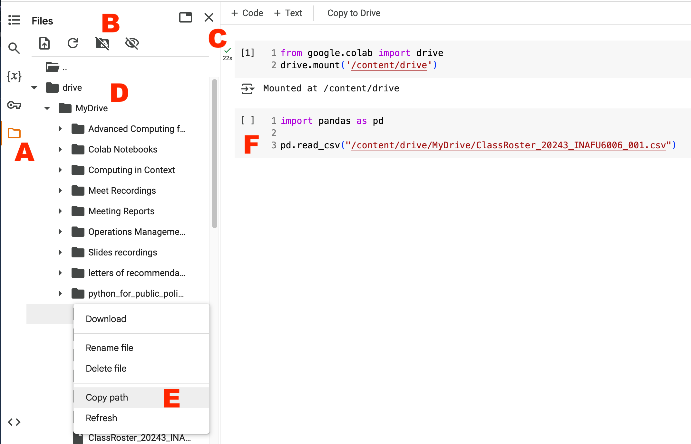

# Open-ended assignments

In [Homework 1](../hw_1.md), [Homework 4](../hw_4.md), and the [Final Project](../final_project.md), you will pick your own dataset(s). For each:

- Use at least one dataset that you aren't familiar with.
  - Using data from a primary source is preferred.
- It should have between one thousand and one million rows.
  - If it's larger than that, you can [make it smaller](#reducing-data-size).
- Finding a dataset available in CSV or JSON is recommended, though [pandas can read other formats](https://pandas.pydata.org/pandas-docs/stable/user_guide/io.html).
- It's ok if you pick the same dataset as another student, as long as you're following [the Academic Integrity rules](../syllabus.md#academic-integrity).

## Open data portals

There are countless places to get data, notably:

- [NYU Libraries Data Sources](https://guides.nyu.edu/datasources)
- Local:
  - [NYC Open Data](https://opendata.cityofnewyork.us/)
    - [Scout](https://scout.tsdataclinic.com/explore/NYC) can be used to find datasets with certain columns
  - [BetaNYC](https://data.beta.nyc/)
- U.S. Federal:
  - [data.gov](https://www.data.gov/)
  - [Census Bureau](https://data.census.gov/)
    - [Census Academy](https://www.census.gov/data/academy.html)
    - [ZIP Code Crosswalk](https://www.huduser.gov/portal/datasets/usps_crosswalk.html)
  - [Federal Reserve Economic Data (FRED)](https://fred.stlouisfed.org/)
- [United Nations](https://data.un.org/)
- [World Bank](https://data.worldbank.org/)
- [World Health Organization (WHO)](https://www.who.int/data)
- [HealthData.gov](https://healthdata.gov/)
- [The Humanitarian Data Exchange](https://data.humdata.org/)
- [Economic Policy Institute](https://www.epi.org/data/)
- [Kaggle](https://www.kaggle.com/datasets)
- [Google Dataset Search](https://datasetsearch.research.google.com/)
- [Black Wealth Data](https://blackwealthdata.org/)
- [DataHub](https://datahub.io/collections)
- [Gallup Global Datasets](https://www.gallup.com/analytics/318923/world-poll-public-datasets.aspx)
- Lists of open data portals:
  - [DataPortals](https://dataportals.org/)
  - [Open Data Network](https://www.opendatanetwork.com/)

## Inspiration

For starters, see the [Final Project examples from past semesters](../final_project/examples.md).

Probably not realistic to make visualizations that are as fancy as these ones made by professionals, but they may give you ideas. Some also include links/downloads of the source data.

- [Climate & Economic Justice Screening Tool](https://screeningtool.geoplatform.gov/)
- [FiveThirtyEight Interactives](https://projects.fivethirtyeight.com/)
- [The Guardian Visual Journalism](https://www.theguardian.com/interactive)
- [Information is Beautiful Awards](https://www.informationisbeautifulawards.com/showcase)
- [New York Times Graphics](https://www.nytimes.com/spotlight/graphics)
- [Our World in Data](https://ourworldindata.org/)
- [ProPublica News Apps](https://www.propublica.org/newsapps/)
- [The Pudding](https://www.pudding.cool/)
- [Statista](https://search.library.nyu.edu/permalink/01NYU_INST/1697t4d/alma990062490650107871)
- [Visual Capitalist](https://www.visualcapitalist.com/)

## Storing data

<!-- https://github.com/googlecolab/colabtools/issues/5663 -->

To work with uploaded files in Google Colab, you have [a lot of options](https://colab.research.google.com/notebooks/io.ipynb). A few recommended options:

### Direct upload

_Fewer steps, but your file(s) will disappear when your session ends._


1. In the Google Colab sidebar, click the `Files` icon (A).
1. Click the upload button (B).
1. Select your file.
1. [Read the file in Python.](#reading-files-in-python)

### Google Drive

_More steps, but your file(s) are preserved between sessions._

Expands on the [instructions to mount Google Drive locally](https://colab.research.google.com/notebooks/io.ipynb#scrollTo=u22w3BFiOveA).



1. Upload the file(s) somewhere in [Drive](https://drive.google.com/drive/my-drive).
1. In the Google Colab sidebar, click the `Files` icon (A).
1. Click the `Mount Drive` icon (B).
   - You may need to run the code it injects to authorize it (C).
   - Think of this as attaching your Drive to your Google Colab instance, as if you were plugging in a USB flash drive.
1. [Read the file in Python.](#reading-files-in-python)

### [InteractiveSheet](https://colab.research.google.com/notebooks/io.ipynb#scrollTo=BC_eQdDHyCji)

You can [import your data into a Google Sheet](https://www.youtube.com/watch?v=C3ic0jqAWJY) and read it directly from Colab.

```python
from google.colab import sheets

sheet_url = "…"
sheet = sheets.InteractiveSheet(url=sheet_url, include_column_headers=True)
df = sheet.as_df()
```

<iframe src="https://www.youtube-nocookie.com/embed/D5MUsMim_is?start=242" title="YouTube video player" frameborder="0" allow="accelerometer; autoplay; clipboard-write; encrypted-media; gyroscope; picture-in-picture; web-share" referrerpolicy="strict-origin-when-cross-origin" allowfullscreen style="aspect-ratio: 16 / 9;"></iframe>

### Reading files in Python

1. Navigate to the file (D).
   - You may need to click into `content`, then `drive`.
1. Next to the filename, click the three dots.
1. Click `Copy path` (E).
   - The value should be something like `/content/drive/My Drive/...`.
1. Use this path with [`read_csv()`](https://pandas.pydata.org/docs/user_guide/io.html#csv-text-files) (F).

Google Colab cannot access the file on your local machine; in other words, the path shouldn't start with `C:\\` or anything like that. [More info about file paths.](https://www.codecademy.com/resources/docs/general/file-paths)

## Reducing data size

You can make data smaller _before_ uploading by filtering it through:

- The data portal, if it supports it
  - This makes the download faster, including only the data you need.
  - [Instructions for Socrata-based portals](https://support.socrata.com/hc/en-us/articles/202950808-Creating-a-Filtered-View)
- The `$limit` parameter (or equivalent), if using an API
  - [Socrata documentation](https://dev.socrata.com/docs/queries/limit)
- In a spreadsheet program
